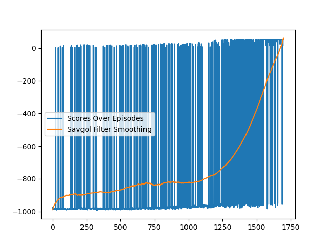

## Abstract

We will be using the popular sandbox video game Minecraft and its associated Malmo platform to train an agent to successfully combat in-game entities known as “mobs.” It is our hope that methods like the ones we are using to train an agent in a simulated environment can be extrapolated to real life applications like robotics in the physical world. We will use a popular reinforcement learning technique called Deep Q Learning using a couple different feature representations and compare the differences in performances.

## Introduction and Background

Minecraft is a popular sandbox video game that contains a number of hostile non-player entities known as “mobs”; these entities are meant to attack and kill the player character. Our agent will have to learn strategies to deal with each type of hostile mob with the goal of defeating as many mobs and surviving as long as possible. Additionally, the environment in a Minecraft “world” can be randomly generated using an algorithm or built by the player. To create a closed environment for our agent to learn and fight against these mobs, we will be using Microsoft’s Project Malmo. Using machine learning in minecraft is the focus of a large competition called MineRL, which provides rigorous guidelines towards achieving an agent that can operate autonomously in minecraft.

## Problem Definition

The agent will have to last as long as possible while defeating as many distinct hostile entities as possible and navigating the environment. The agent will receive positive rewards for defeating entities/surviving and negative rewards for being defeated or losing health itself. We would ideally like to define a dense reward system, but if this does not prove to be possible, we will stick with a sparse reward system, such as death equating to a large negative reward.  Currently, we are using a dense reward system when it comes to fighting the mobs, since the agent is rewarded every time it damages a zombie. However, we are still using a sparse reward system for survival since we haven’t figured out how to create a direct reward for the agent losing health, although this is something we would like to implement in the future. Below are listed the present actions and rewards we used to train our preliminary RL model:
* Action Space: Move Forward, Move Backward, Attack (i.e. destroy block, NOT attack entity which was a mistake), Turn Left, Turn Right, Use
* Rewards: Death (-1000), Damaging Zombie (50), Surviving for one frame (1)

## Data Collection
Since we are using Deep Q Learning, we did not have to collect any data. The agent’s observations in the environment was our “data,” on which the neural network trained on. While the agent was training, we also saved a subset of these observations/images for future use. These images could be useful in training our autoencoder in the future.

## Methods

We used a Convolutional Deep Q Network to take in the image input and output what action(s) to take. Similar to most CNNs, we started with the CNN workflow (Convolution, Max Pooling, Activation) and then used some fully connected layers. We also used a replay buffer to allow the agent to have “memory,” giving the agent a way to utilize past trials. Another implementation detail is that we used a target network that we copied the weights to periodically so that our DQN converged to a more stable solution. As prior research had shown us, using a recurrent neural network would not give us significant improvements so this is not a path we decided to follow [2].

As a baseline model we took the feature representation from a large pre-trained CNN such as ResNet50, by using the model and excluding the final dense layer, and using this in place of our convolution layers. We predicted that this would likely get us some performance, but would inherently be worse, since we had fixed some of our trainable parameters.

We decided that if we have extra time, we would have also liked to see the performance of using the lower dimensional space generated by an autoencoder as our input for the DQN instead of the representation from ResNet50 or the image itself. We could create an autoencoder by creating a dataset from the images we get from our environment and then using an encoder and decoder in series to approximate the original image. Then using an optimizer to reduce the MSE between the generated image and the original image should have yielded us both an encoder and decoder. We would have then used the encoder to produce a feature set from a given frame for the DQN to use.

## Metrics
While we do have a loss function we can plot to track learning, for our reinforcement learning problem, tracking the metric of total reward per episode is a better measure of our progress. This metric is essentially how well the agent played in its environment during that specific episode. We do not really have data to split for K-fold validation, but we can train entirely new models for different configurations of our hyperparameters and evaluate them based on the total reward per episode metric. We will also evaluate the different feature representations based on the total reward per episode. The loss function we used for the DQN is MSE (mean-squared error) since our Q-value function is a continuous function. Applying gradient descent or another optimization method to minimize this function allowed our network to learn the Q-value function.

## Results

The results of our training did show learning within our reward scheme, but that reward scheme was not optimal for what we wanted our agent to learn. With the large negative reward of -1000 for dying and the maximum number of steps set to 50, the agents reward was usually either 50 (since it survived the entire episode) or something less than -950. Because of this, any other rewards that could have been explored would be overlooked since the negative reward for dying had such a large magnitude. We can see this in the graph below, in which the rewards are sporadic and shifting between around 0 and -1000. Although as time passes, we see that the density of rewards that were around the 0 mark increases while the opposite occurred for the -1000 rewards. The Savitzky-Golay smoothing filter visualizes this nicely. While these results were less than ideal, we were still able to get something running and learning in the minecraft environment, which was our main goal for this touchpoint.

While neither of the networks performed optimally, the CNN did perform better than ResNet50 as expected. We have not tested the autoencoder yet, but are expecting similar results.

## Conclusion

The agent performed relatively poorly, we believe, due to issues with the action space and the reward parameters. The action for the agent to attack hostile entities 1) did not allow the agent to actually damage the entity and 2) operated on a brief time period; the result was that the agent learned to run away from the hostile entity as opposed to engaging. The solution to this would be to change the attack action to one that would allow the agent to damage the entity and attack more often, hopefully resulting in the agent learning the desired behavior.

A significant issue with the reward parameters was the magnitude of the penalty for death; in the reward over iterations graph, this can be seen in how many times the iteration reward dropped to -1000. The penalty for death was so great that the agent began to learn to avoid death as opposed to trying to engage the hostile entity; this manifested in the behavior of running away until the step limit was reached. The reward parameters would need some more tuning to achieve the desired behavior.

## References
[1] Christian S., Yanick S., & Manfred V. (2020). Sample Efficient Reinforcement Learning through Learning from Demonstrations in Minecraft. arXiv. Retrieved March 1, 2021, from https://arxiv.org/abs/2003.06066

[2] Clément R., & Vincent B. (2019). Deep Recurrent Q-Learning vs Deep Q-Learning on a simple Partially Observable Markov Decision Process with Minecraft. arXiv. Retrieved March 1, 2021, from https://arxiv.org/abs/1903.04311

[3] Volodymyr M., Koray, K., David, S., Alex, G., Ioannis A., Daan W., & Martin R. (2013). Playing Atari with Deep Reinforcement Learning. arXiv. Retrieved March 1, 2021, from https://arxiv.org/abs/1312.5602
